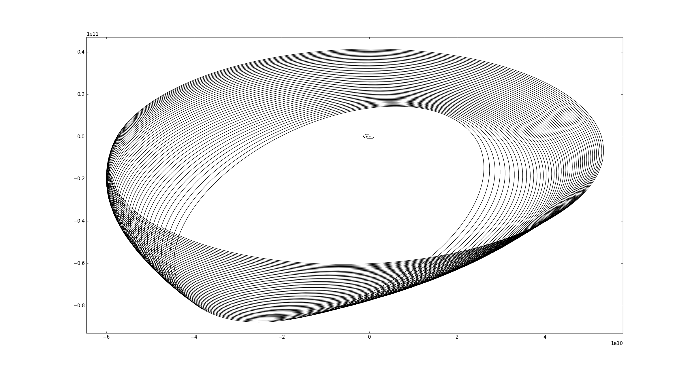

# Evolutionary Neurocontrol

1. Transcribe the trajectory optimisation problem and neural network parametres into a nonlinear programme (NLP):
 - initial time
 - ending time
 - ending orbital parametres
 - neural network weights and biases
2. Use a meta-heuristic algorithm to manipulate the NLP parametres.
 - e.g. self-adaptive differential evolution
3. For each optimiser iteration, propogate the system with the neural network as a reactive controller.
 - using and adaptive numerical integrator, e.g. Runge-Kutta-Fehlberg 78
 - propogate until termination condition, e.g. max duration and/or optimality.
 
 #  Supervised learning
 
 1. Generate database of optimal lunar trajectories to halo orbit from various different initial conditions
  - low thrust
  - impulsive
  - using direct transcription method, e.g. Sim-Flanagan leg from initial position to periapsis/apoapsis.
  
 # Meta
 
 1. Develop low-energy lunar trajectory optimisation tools with C++ backend and Python frontend.

